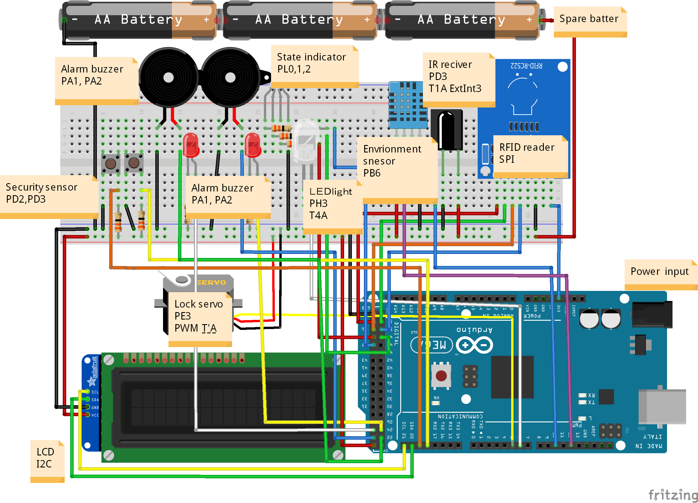
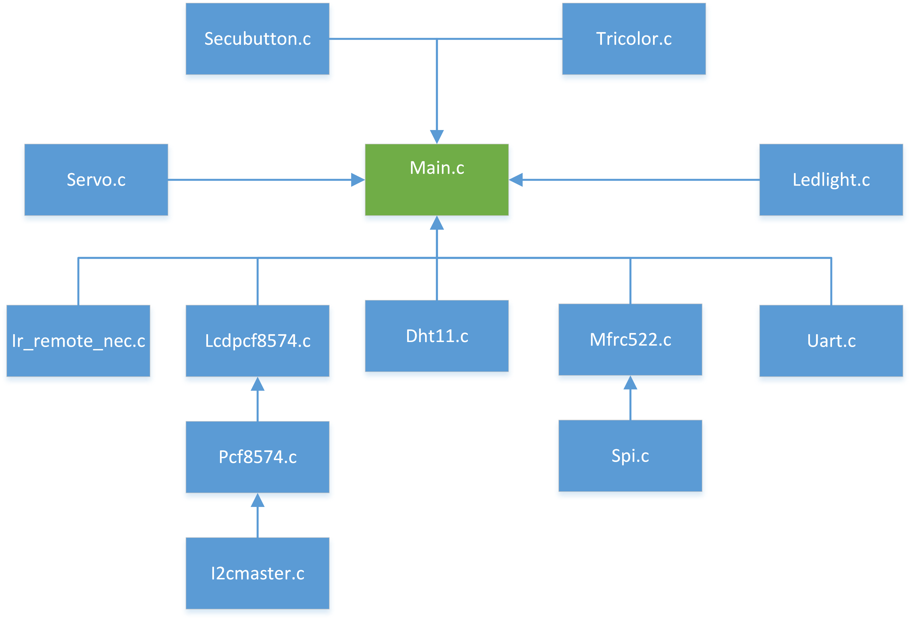

# safety-showcase
a safety critical showcase control system based on Ateml ATmega2560 
## Introduction

This project built a safety showcase control system. Its main task is to keep exhibits in side showcase safe, environment-hurt and man-made-hurt. So It has functions like security alarm, LED light control, temperature and huminidity monitor, showcase access control. The operation manual can be found inside the Modern Embedded System Programming [course report](showCaseController_ESP5200Report.pdf). Also, there is a [safety critical design report](safety_critical_system_Report.pdf), which specify the safte critical part of this show case system.  

## Development Environment
* Development Board: Audrino mega 2560
* Development Language: C
* IDE: Atmel Studio 7
* Debug Tools: Dragon Board
## Harware connection

## Software structure

